# PlexusPulse

A Flutter project built with a **feature‑based Clean Architecture**.

## Architecture Overview

This project follows Clean Architecture principles to ensure separation of concerns, high testability, and scalability.

Dependencies always flow **inward**: `Presentation → Domain → Data → External`

### Layer Summary

- **Presentation Layer**: Screens, Widgets, State Management (Riverpod / Bloc), Controllers / Providers.
- **Domain Layer**: Entities, Use Cases, Repository Interfaces. *(Does not depend on Flutter, APIs, or databases)*
- **Data Layer**: Repository Implementations, Models, Remote/Local Data Sources.
- **External Services**: REST API, WebSocket, Local Database (Hive/SQLite), Firebase.

For full architectural details and diagrams, please see:
- [Clean Architecture Overview](docs/plexuspulse_clean_architecture.md)

