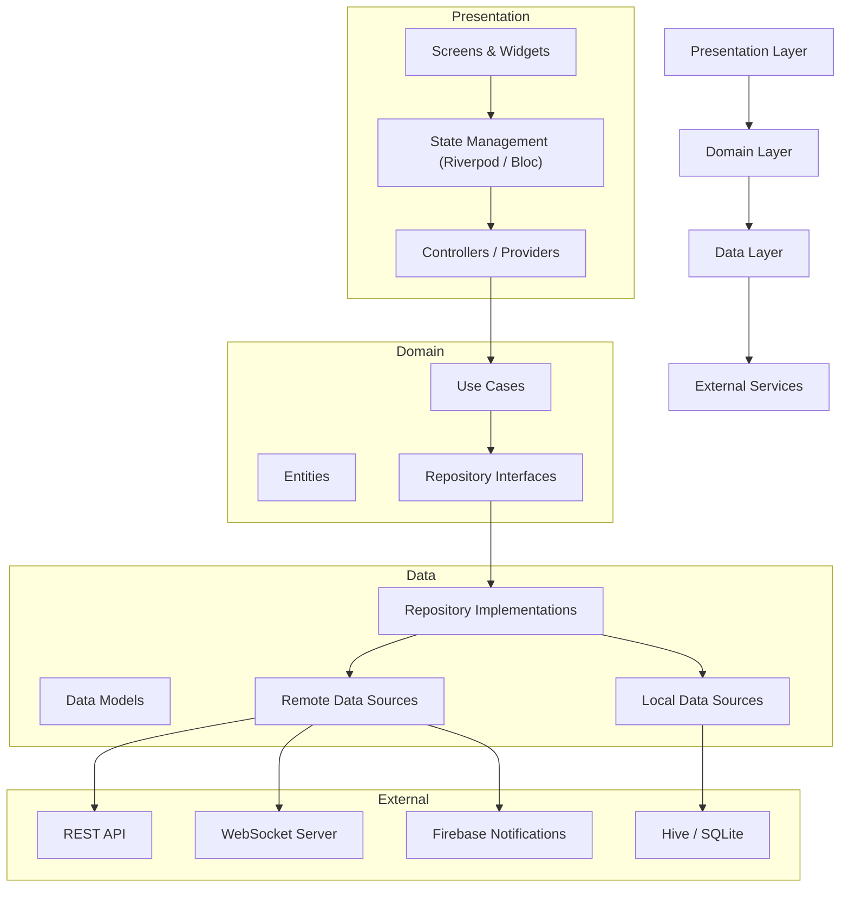

# PlexusPulse – Full Project Layer Diagram

This document describes the **feature‑based Clean Architecture structure** used in the PlexusPulse Flutter project.

The project follows these principles:

- Feature‑based modular architecture
- Clean Architecture (Presentation → Domain → Data)
- Separation of concerns
- Dependency inversion
- Scalable structure for large applications

---

# High-Level Project Structure

```text
lib/
├── config/
│   ├── router/
│   ├── theme/
│   ├── dependency_injection/
│   └── environment/
│
├── core/
│   ├── constants/
│   ├── errors/
│   ├── network/
│   ├── utils/
│   └── base/
│
└── features/
    ├── authentication/
    │   ├── data/
    │   ├── domain/
    │   └── presentation/
    │
    ├── dashboard/
    │   ├── data/
    │   ├── domain/
    │   └── presentation/
    │
    ├── devices/
    │   ├── data/
    │   ├── domain/
    │   └── presentation/
    │
    └── alerts/
        ├── data/
        ├── domain/
        └── presentation/
```

---

# Full Project Layer Diagram



---

# Dependency Rule

Dependencies always flow **inward**:

```
Presentation → Domain → Data → External
```

Important rule:

- **Domain layer must not depend on Flutter, APIs, or databases**
- **Data layer implements domain interfaces**
- **Presentation only communicates with use cases**

---

# Example Feature Architecture

Example: **devices feature**

```text
features/devices/

data/
 ├── datasource/
 │    ├── device_remote_datasource.dart
 │    └── device_local_datasource.dart
 │
 ├── models/
 │    └── device_model.dart
 │
 └── repositories/
      └── device_repository_impl.dart

domain/
 ├── entities/
 │    └── device.dart
 │
 ├── repositories/
 │    └── device_repository.dart
 │
 └── usecases/
      ├── get_devices.dart
      └── get_device_details.dart

presentation/
 ├── screens/
 │    ├── devices_screen.dart
 │    └── device_details_screen.dart
 │
 ├── widgets/
 │    └── device_card.dart
 │
 └── providers/
      └── device_provider.dart
```

---

# Data Flow Example

Example: **Loading device list**

```
DevicesScreen
      ↓
DeviceProvider (Riverpod)
      ↓
GetDevicesUseCase
      ↓
DeviceRepository (Domain Interface)
      ↓
DeviceRepositoryImpl (Data Layer)
      ↓
RemoteDataSource / LocalDataSource
      ↓
API / Local Database
```

---

# Folder Responsibilities

## config

Application configuration.

Examples:

- App router
- App theme
- Dependency injection
- Environment configuration

---

## core

Shared utilities used across all features.

Examples:

- API client
- Error handling
- Constants
- Utilities
- Base classes

---

## features

Each feature is isolated and contains its own:

- data layer
- domain layer
- presentation layer

This makes the project **modular and scalable**.

---

# Advantages of This Architecture

- Scalable for large applications
- Highly testable
- Feature isolation
- Clear separation of concerns
- Easier maintenance

---

# Architecture Summary

```
Presentation
     ↓
Domain
     ↓
Data
     ↓
External Services
```
